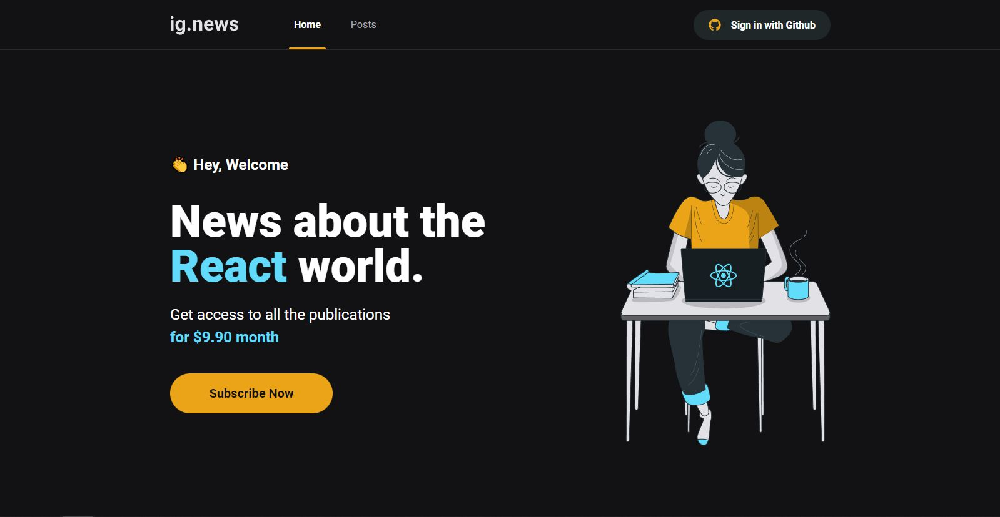

<h1 align="center">📰 Ignews</h1>



> 🔎 Um Blog com CMS integrado e forma de pagamento com assinatura

## 📁 Páginas

O site tem no total 5 páginas, sendo elas:

- **Home:** A página oferece a opção de fazer login com o Github ou de criar uma assinatura no site.
- **Posts:** Oferece uma listagens de todos os posts que têm no site, porém deve possui assinatura para ver eles completos.
- **Preview (Sem assinatura):** Uma página para ver apenas um pedaço do post caso o usuário não tenha assinatura.
- **Post (Com assinatura):** Uma página apresentando o post completo.
## 🚀 Tecnologias

- [Jamsack](https://jamstack.org/)
- [Typescript](https://www.typescriptlang.org/)
- [Next.js](https://nextjs.org/)
- [NextAuth.js](https://next-auth.js.org/)
- [FaunaDB](https://fauna.com/)
- [Axios](https://axios-http.com/ptbr/docs/intro)
- [Stripe](https://stripe.com/br)
- [Prismic CMS](https://prismic.io/)
- [SASS](https://sass-lang.com/)

## :closed_book: Como usar?

Antes de iniciar, você precisa ter [Git](https://git-scm.com) e [Node](https://nodejs.org/en/) instalados.

```bash
# Clone this project
$ git clone https://github.com/Kayke-Fujinaka/ig.news

# Access
$ cd ignews

# Install dependencies
$ yarn or npm

# Run the project
$ yarn start or npm start

# The server will initialize in the <http://localhost:3000>
```

## 🤝 Colaboradores

Agradecemos às seguintes pessoas que contribuíram para este projeto:

<table>
  <tr>
    <td align="center">
      <a href="#">
        <br>
        <sub>
          <b>Kayke Fujinaka</b>
        </sub>
      </a>
    </td>
  </tr>
</table>

## 📝 Licença

Este projeto está sob licença. Consulte o arquivo [LICENSE](LICENSE.md) para obter mais detalhes.

&#xa0;

<a href="#top">Volte para o topo</a>
